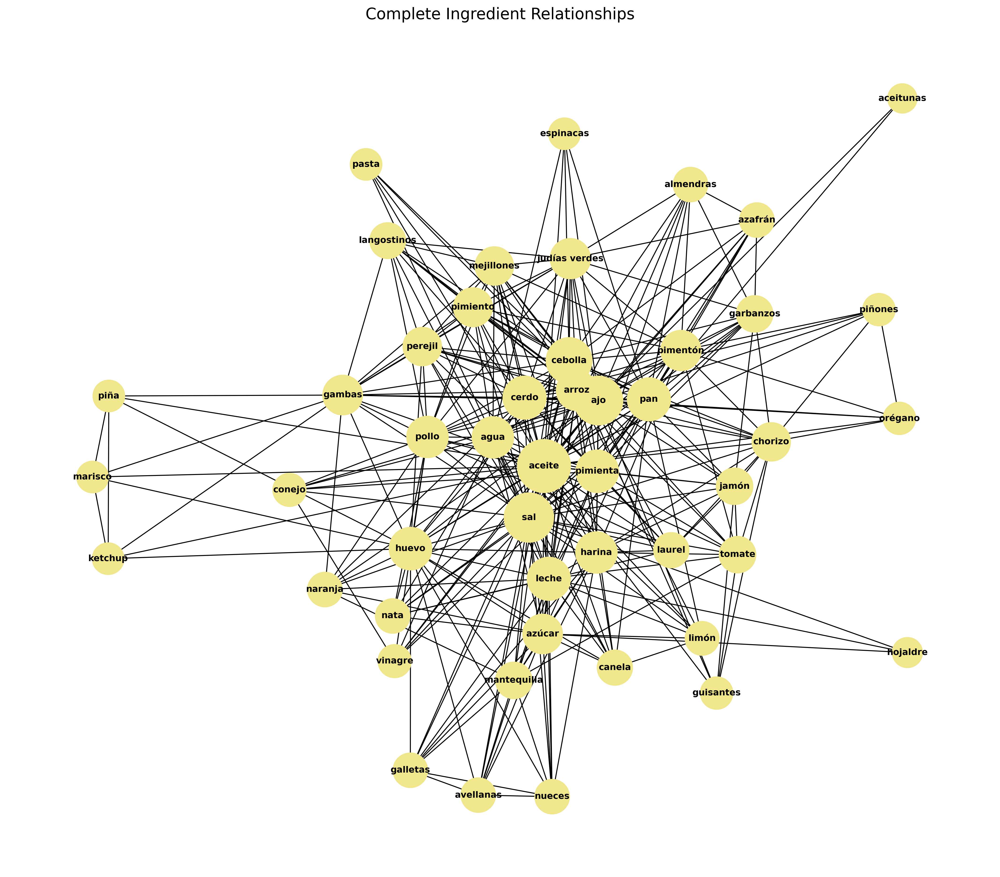

# NLP in Spanish Cuisine Recipes 📖 🥘

This project uses Natural Language Processing (NLP) and graph theory to analyze ingredient relationships in Spanish recipes, revealing common combinations and culinary patterns.

<div align="center">
  
</div>

## Overview

Completed for the "Text Analysis and Information Retrieval" course at the University of Oviedo, this analysis examines hundreds of Spanish recipes to discover which ingredients are commonly used together. By applying text mining techniques and graph analysis, I've uncovered interesting patterns in Spanish cuisine and identified key ingredient communities.

## Sample Data

The starting point was a PDF recipe book with ingredient lists formatted as shown below:

<div align="center">
  
  <p><em>Example of how ingredients are presented in the source PDF. The text extraction process needed to handle inconsistent formatting and special characters.</em></p>
</div>

## Methodology

### 1. Text Extraction & Preprocessing

The project pipeline begins with extracting text from a Spanish recipe book:

- Used `PyPDF2` to parse PDF content from odd-numbered pages (11-95) where ingredients were listed
- Applied text normalization to handle encoding issues and inconsistent formatting
- Created a structured dataset of ingredient lists by recipe

### 2. NLP Analysis

The core NLP processing identified ingredients and their relationships:

- Implemented a custom SpaCy pipeline with a `PhraseMatcher` to detect Spanish ingredients
- Created an ingredient synonym system to handle variations (e.g., "ajo en polvo" → "ajo")
- Built a co-occurrence matrix tracking which ingredients appear together in recipes

### 3. Graph Analysis

To visualize and analyze ingredient relationships:

- Created weighted graphs where nodes are ingredients and edges represent co-occurrence frequency
- Applied centrality measures (degree, betweenness, closeness) to identify key ingredients
- Used community detection to discover ingredient clusters that frequently appear together

## Key Findings

The analysis revealed several insights about Spanish cuisine:

- Core ingredients like garlic, onion, and olive oil form the foundation of many recipes
- Distinct ingredient communities emerged, corresponding to different styles of Spanish cooking
- The most central ingredients by betweenness centrality indicate "bridge" ingredients used across different types of dishes

## Visualization Results

### Ingredient Relationship Graph

This visualization shows relationships between ingredients that commonly appear together:

<div align="center">
  
  <p><em>Node size indicates the number of connections, and edge thickness represents how frequently ingredients appear together.</em></p>
</div>

### Important Connections

This graph highlights only the strongest ingredient relationships (connections with weight ≥ 3), revealing the most significant combinations in Spanish cuisine:

<div align="center">
  
  <p><em>Only connections that appear in 3 or more recipes are shown, emphasizing the strongest culinary combinations.</em></p>
</div>

### Ingredient Communities

Ingredients naturally cluster into communities that reflect different culinary styles:

<div align="center">
  
  <p><em>Colors represent different ingredient communities detected by the Louvain algorithm.</em></p>
</div>

## Technologies Used

- **Python**: Core programming language
- **SpaCy**: NLP processing and entity recognition
- **NetworkX**: Graph creation and analysis
- **Matplotlib**: Data visualization
- **PyPDF2**: PDF text extraction
- **Community**: Community detection algorithms

## Future Work

Potential extensions to this project:

- Develop a recipe recommendation system based on available ingredients
- Analyze cooking techniques in relation to ingredient combinations
- Create an interactive web visualization of ingredient networks
- Apply sentiment analysis to recipe reviews to correlate with ingredient combinations

## Installation & Usage

```bash
# Clone the repository
git clone https://github.com/Rubenpombo/NLP-in-recipes.git

# Install dependencies
pip install -r requirements.txt

# Run the preprocessing
python preprocessing.py

# Run NLP analysis
python nlp.py

# Generate graphs and visualizations
python graph_analysis.py